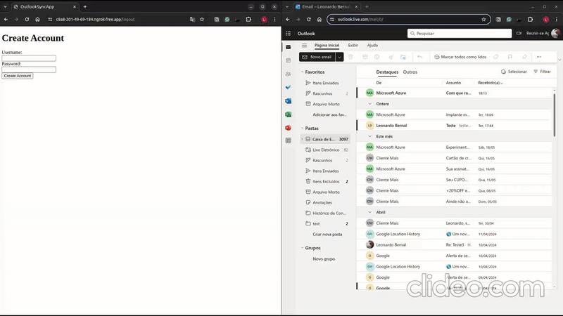

# OutlookSyncApp

## Description
OutlookSyncApp is an application designed to provide an integration between a local account and Outlook mail. The application offers API endpoints that allows users to create a local account and link it with their Outlook email address using OAuth. Upon successful account linking, the application synchronizes email data from Outlook to the local database. 

In addition to the initial synchronization, the application continuously monitors for changes in user email data, including changes in read/unread status, flags, deletions, and new emails. Any changes detected are promptly reflected in the local data and on the webpage, ensuring that the local database and user interface are always up-to-date with the Outlook mail.

## Requirements
- Node.js (v20.13.1 used for this project)
- NPM
- Microsoft Azure account
- NGROK account
- Docker/Docker Compose

## Configuration

### Microsoft Azure
1. Create an Azure account and register a new application in the Azure portal.
2. Go to the Azure portal (https://portal.azure.com) and sign in with your Microsoft account.
3. Select “App registrations”, click on “New registration” and fill in the required details like “Name” and “Supported account types.” (Accounts in any organizational directory was used for this project).
4. In the “Redirect URI” section, add “http://localhost:3000/outlook/redirect". (This is the URI where the user will be redirected after authenticating with Outlook. The URI can be changed to a different port if needed.)
5. After registering, go to Certificates & Secrets and create a new client secret. Copy both the client secret and the client ID into your `.env` file.

### NGROK
1. Create an NGROK account (https://ngrok.com/).
2. Go to NGROK dashboard (https://dashboard.ngrok.com/).
3. Copy the NGROK authtoken (https://dashboard.ngrok.com/get-started/your-authtoken). to the `.env` file.

## Setup
1. Clone the repository.
2. Copy the `.env.example` file to `.env` and change the values to your own.
3. Run `docker-compose up -d rabbitmq elasticsearch ngrok` to start the required services.
4. Replace `AZURE_NOTIFICATIONS_URI` and `AZURE_REDIRECT_URI` in the `.env` file with your NGROK URI. Don't forget to add this URI to Azure redirect endpoint. Also, update `APP_URI` in `account.html` with the same NGROK URI. Tip: Look for CHANGE_ME in the files.
5. Run `docker-compose up -d --build server` to start the application.

## Application Flow
This section describes the step-by-step flow of the OutlookSyncApp application, from accessing the homepage to syncing the Outlook account and viewing emails.

1. **Accessing the Homepage (/)**
    - Description: Users start by navigating to the homepage.
    - File: index.html
    - Action: The homepage displays a form for creating a new account.

2. **Creating an Account**
    - Description: Users fill in the username and password fields and submit the form.
    - Endpoint: /users
    - Action:
        - The form submission sends a request to create a new user.
        - On successful account creation, user data is stored locally and the user is redirected to account.html.

3. **Accessing the Account Page (/account.html)**
    - Description: After logging in, users are redirected to the account page.
    - File: account.html
    - Action:
        - The application checks if the user is logged in by verifying the presence of user data in local storage.
        - If no user data is found, the user is redirected back to the homepage.
        - The page displays a button to sync the Outlook account and navigation buttons for viewing emails.

4. **Syncing the Outlook Account**
    - Description: Users initiate syncing with their Outlook account.
    - Endpoint: /outlook/signin
    - Action:
        - Clicking the "Sync your Outlook account" button directs the user to the /outlook/signin endpoint.
        - The signIn method generates the Outlook OAuth authorization URL and redirects the user to Outlook for authentication.

5. **Handling OAuth Redirect (/outlook/redirect)**
    - Description: After authenticating with Outlook, users are redirected back to the application.
    - Endpoint: /outlook/redirect
    - Action:
        - The redirect method exchanges the authorization code for an access token.
        - The user's Outlook data is stored in the session and published for synchronization.
        - The user is redirected back to account.html.

6. **Monitoring Outlook Email Changes**
    - Description: The application listens for changes in the user’s Outlook email.
    - Endpoint: /outlook/notifications
    - Action:
        - When a change is detected, Outlook sends a notification to the /outlook/notifications endpoint.
        - The handleNotification method processes these notifications and publishes updates for synchronization.

7. **Displaying Emails**
    - Description: Users view the list of emails stored locally in the mailbox.
    - Endpoint: /mails
    - Action:
        - On account.html, the application displays emails from the local database.
        - Users navigate through emails using the "Previous Page" and "Next Page" buttons, which fetch emails based on the current page and page size.

8. **Real-Time Email Updates**
    - Description: The application updates the email list in real-time.
    - Action:
        - The application uses Socket.io to listen for real-time updates.
        - When an email update is received, it updates the email list displayed on account.html.

9. **Logging Out**
    - Description: Users log out from the application.
    - Endpoint: /users/logout
    - Action:
        - Clicking the "Logout" button clears the user and Outlook data from local storage and redirects the user back to the homepage.

## Documentation
- The API documentation can be found at `/api` endpoint.
